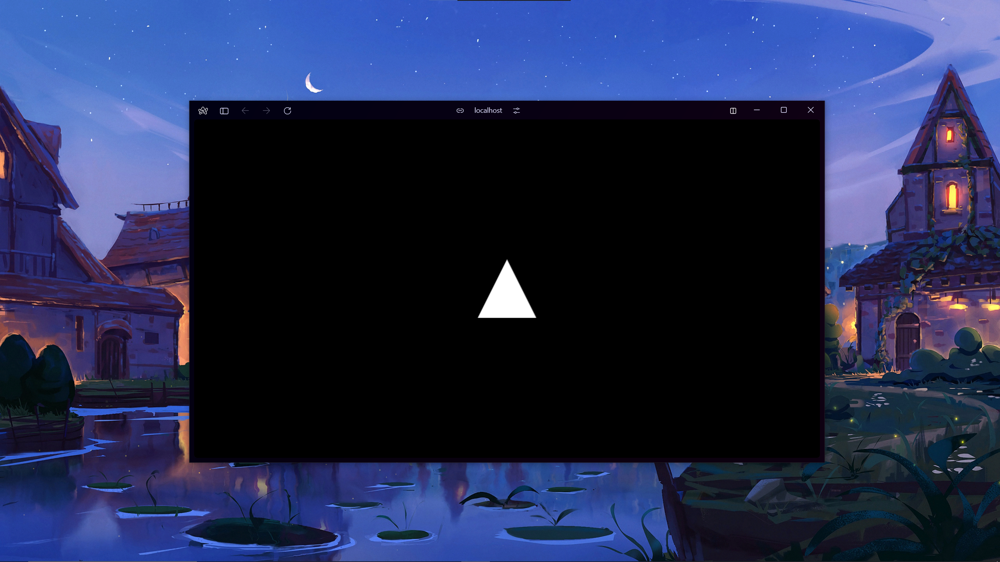
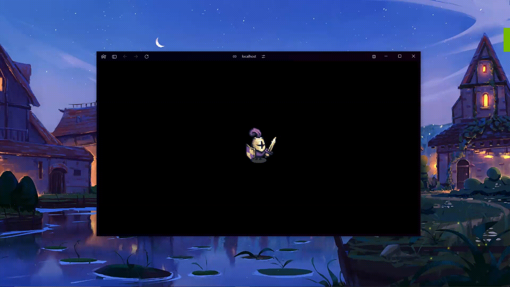

# Emerald

Emerald is a 2D graphics engine that can help you create games easier than ever. This repository contains a demo scene that uses the engine as well as the code of it in the `src/emerald` folder.


## Table of Contents

- [Getting Started](#getting-started)
- [Usage](#usage)
    - [Basic Setup](#basic-setup)
    - [Set the background color](#set-the-background-color-for-the-engine)
    - [Drawing the scene](#drawing-the-scene)
- [Scene](#scene)
    - [Adding and removing items from the scene](#adding-and-removing-items-from-the-scene)
    - [Set Active Scene](#set-active-scene)
- [Objects](#objects)
    - [Square2D](#square2d)
    - [Triangle2D](#triangle2d)
    - [Texture](#texture)
- [Object methods](#object-methods)
    - [Position](#position)
    - [Rotation](#rotation)
    - [Scale](#scale)
    - [Change color](#change-color)
    - [Set texture frame](#set-texture-frame)
- [Animations](#animations)
- [Collision Detection](#collision-detection)
- [ObjectGroup](#objectgroup)
- [EventManager](#eventmanager)
- [AudioManager](#audiomanager)
- [Camera](#camera)
- [FPSCounter](#fpscounter)


## Getting Started

Clone this repository to your desired location.
```bash
git clone https://github.com/vahan-gev/emerald.git
```
Navigate into the folder and install the dependencies.
```bash
cd emerald
npm install
```
Edit the demo code in `App.js` and run `npm start`

## Usage

### Basic Setup

```javascript
const emerald = new Emerald(canvas); // You should pass your own canvas element here
const scene = new Scene();
```

### Set the background color for the engine
```javascript
emerald.setBackgroundColor(color) // color = new Color(r, g, b, a = 255);
```

### Drawing the scene

To draw items in the screen you need some sort of animation loop. I use `window.requestAnimationFrame` for this. Here is a basic example:

```javascript
const animate = () => {
  emerald.drawScene(scene); // You need this line to tell the engine what to draw
  window.requestAnimationFrame(animate);
};
animate();
```

## Scene

Emerald has multiple scenes support. In order to render any object it has to be added to the scene using the `add` method.

### Adding and removing items from the scene

```javascript
// Adding an object to the scene
scene.add(square);

// Removing an object from the scene
scene.remove(square);
```

### Set Active Scene
```javascript
// When changing a scene you should deactivate current scene to not mess up the event manager.

// Activate Scene
scene.setIsActive(true);

// Deactivate Scene
scene.setIsActive(false);

```

## Objects

### Square2D

```javascript
/*
    ARGUMENTS:
    1. gl = You will have this variable after the basic setup (emerald.gl). It is basically canvas.getContext('webgl');
    2. programInfo = You will have this variable after the basic setup as well (emerald.programInfo). 
    3. useTexture: boolean = Specify if the shape should use a texture or use a color.
    4. texturePath = If useTexture = true then specify the path for the texture that you want to use. (THIS IS OPTIONAL. If useTexture = false you can just skip this argument or pass null for it.)
    5. position: [x, y, z] = Position of the shape (THIS IS OPTIONAL. You can just skip this argument or pass null for it and it will create the shape in the origin [0.0, 0.0, 0.0].)
    6. scale: [x, y, z] = Scale of the shape (THIS IS OPTIONAL. You can just skip this argument or pass null for it and it will create the shape with the default scale of [100.0, 100.0, 1.0] in pixels.)
    7. rotation: [x, y, z] = Rotation of the shape (THIS IS OPTIONAL. You can just skip this argument or pass null for it and it will create the shape with the default rotation of [0.0, 0.0, 0.0] in radians.)
    8. frameWidth: int = The width of each frame. If you are using a texture and it is a spritesheet pass the width of each frame. (THIS IS OPTIONAL. If useTexture = false you can just skip this argument or pass 0 for it.)
    9. frameHeight: int = The height of each frame. If you are using a texture and it is a spritesheet pass the height of each frame. (THIS IS OPTIONAL. If useTexture = false you can just skip this argument or pass 0 for it.)
    10. framesPerRow: int = How many frames are in one row in your spritesheet (THIS IS OPTIONAL. If useTexture = false you can just skip this argument or pass 1 for it.)
    11. totalFrames: int = How many total frames does your spritesheet have. (THIS IS OPTIONAL. If useTexture = false you can just skip this argument or pass 1 for it.)
    12. animationSpeed: int = Speed of change of every frame (THIS IS OPTIONAL. If useTexture = false you can just skip this argument or pass any number for it.) 
    13. autoPlay: boolean = Specify if you want the animation to play automatically. If you don't want any animation then pass false for it (THIS IS OPTIONAL. If useTexture = false you can just skip this argument or pass false for it.)
*/

// Minimum version
let square = new Square2D(
    emerald.gl,
    emerald.programInfo,
    false
);
```


### Triangle2D

```javascript
/*
    ARGUMENTS:
    1. gl = You will have this variable after the basic setup (emerald.gl). It is basically canvas.getContext('webgl');
    2. programInfo = You will have this variable after the basic setup as well (emerald.programInfo). 
    3. useTexture: boolean = Specify if the shape should use a texture or use a color.
    4. texturePath = If useTexture = true then specify the path for the texture that you want to use. (THIS IS OPTIONAL. If useTexture = false you can just skip this argument or pass null for it.)
    5. position: [x, y, z] = Position of the shape (THIS IS OPTIONAL. You can just skip this argument or pass null for it and it will create the shape in the origin [0.0, 0.0, 0.0].)
    6. scale: [x, y, z] = Scale of the shape (THIS IS OPTIONAL. You can just skip this argument or pass null for it and it will create the shape with the default scale of [100.0, 100.0, 1.0] in pixels.)
    7. rotation: [x, y, z] = Rotation of the shape (THIS IS OPTIONAL. You can just skip this argument or pass null for it and it will create the shape with the default rotation of [0.0, 0.0, 0.0] in radians.)
    8. frameWidth: int = The width of each frame. If you are using a texture and it is a spritesheet pass the width of each frame. (THIS IS OPTIONAL. If useTexture = false you can just skip this argument or pass 0 for it.)
    9. frameHeight: int = The height of each frame. If you are using a texture and it is a spritesheet pass the height of each frame. (THIS IS OPTIONAL. If useTexture = false you can just skip this argument or pass 0 for it.)
    10. framesPerRow: int = How many frames are in one row in your spritesheet (THIS IS OPTIONAL. If useTexture = false you can just skip this argument or pass 1 for it.)
    11. totalFrames: int = How many total frames does your spritesheet have. (THIS IS OPTIONAL. If useTexture = false you can just skip this argument or pass 1 for it.)
    12. animationSpeed: int = Speed of change of every frame (THIS IS OPTIONAL. If useTexture = false you can just skip this argument or pass any number for it.) 
    13. autoPlay: boolean = Specify if you want the animation to play automatically. If you don't want any animation then pass false for it (THIS IS OPTIONAL. If useTexture = false you can just skip this argument or pass false for it.)
*/

// Minimum version
let triangle = new Triangle2D(
    emerald.gl,
    emerald.programInfo,
    false
);
```



### Texture

```javascript
/*
    ARGUMENTS:
    1. gl = You will have this variable after the basic setup (emerald.gl). It is basically canvas.getContext('webgl');
    2. programInfo = You will have this variable after the basic setup as well (emerald.programInfo). 
    3. useTexture: boolean = Specify if the shape should use a texture or use a color.
    4. texturePath = If useTexture = true then specify the path for the texture that you want to use. (THIS IS OPTIONAL. If useTexture = false you can just skip this argument or pass null for it.)
    5. position: [x, y, z] = Position of the shape (THIS IS OPTIONAL. You can just skip this argument or pass null for it and it will create the shape in the origin [0.0, 0.0, 0.0].)
    6. scale: [x, y, z] = Scale of the shape (THIS IS OPTIONAL. You can just skip this argument or pass null for it and it will create the shape with the default scale of [100.0, 100.0, 1.0] in pixels.)
    7. rotation: [x, y, z] = Rotation of the shape (THIS IS OPTIONAL. You can just skip this argument or pass null for it and it will create the shape with the default rotation of [0.0, 0.0, 0.0] in radians.)
    8. frameWidth: int = The width of each frame. If you are using a texture and it is a spritesheet pass the width of each frame. (THIS IS OPTIONAL. If useTexture = false you can just skip this argument or pass 0 for it.)
    9. frameHeight: int = The height of each frame. If you are using a texture and it is a spritesheet pass the height of each frame. (THIS IS OPTIONAL. If useTexture = false you can just skip this argument or pass 0 for it.)
    10. framesPerRow: int = How many frames are in one row in your spritesheet (THIS IS OPTIONAL. If useTexture = false you can just skip this argument or pass 1 for it.)
    11. totalFrames: int = How many total frames does your spritesheet have. (THIS IS OPTIONAL. If useTexture = false you can just skip this argument or pass 1 for it.)
    12. animationSpeed: int = Speed of change of every frame (THIS IS OPTIONAL. If useTexture = false you can just skip this argument or pass any number for it.) 
    13. autoPlay: boolean = Specify if you want the animation to play automatically. If you don't want any animation then pass false for it (THIS IS OPTIONAL. If useTexture = false you can just skip this argument or pass false for it.)
*/

// Minimum version
let texture = new Texture(
    emerald.gl,
    emerald.programInfo,
    true,
    grass,
    [0, 0, 0],
    [100, 100, 1],
    [0, 0, 0],
    16,
    16,
    16,
    256,
    0,
    false
);
```


## Object methods

### Position

You can move objects using their `setPosition` method. Example:
```javascript
texture.setPosition(x, y, z);
```

You can get the position of the object using the `getPosition` method. Example:
```javascript
texture.getPosition();
```

### Rotation

You can rotate objects using their `setRotation` method. Example:
```javascript
square.setRotation(radian);
```

You can get the rotation of the object using the `getRotation` method. Example:
```javascript
square.getRotation();
```

### Scale

You can scale objects using their `setScale` method. Example:
```javascript
triangle.setScale(width, height);
```

You can get the scale of the object using the `getScale` method. Example:
```javascript
triangle.getScale();
```

### Change color

If useTexture = false then the object will be white by default. If you want to change the color of the object you can use its `setColor` method. Example: 
```javascript
square.setColor(color); // color = new Color(r, g, b, a = 255);
```

### Set texture frame

If useTexture = true then the engine will use the bottom-left frame of the image provided. In order to change the frame of the texture use its `setFrame` method. Example:
```javascript
texture.setFrame(frame); // frame: int = index of the frame, bottom-left is 0.
```


## Animations

The animations here work pretty simple. You just have to create an array of frame indexes and pass it to the animation function. There are 2 animation functions: `playAnimation` and `playAnimationOnce`. 
```javascript

/*
    - playAnimation(animation, animationSpeed = 1000);
    ARGUMENTS: 
    animation: [] = array of animation frames 
    animationSpeed: int = Speed of change of every frame 
    
    - playAnimationOnce(animation, defaultAnimation = null, animationSpeed = 1000, callbackFunction = null);
    ARGUMENTS:
    animation: [] = array of animation frames
    defaultAnimation: [] = (OPTIONAL) if provided, after the animation is done the object will play the default animation in an endless loop.
    animationSpeed: int = Speed of change of every frame
    callbackFunction: function = (OPTIONAL) if provided, after the animation is done this function will be called.
*/

```

The main difference between these functions is that the `playAnimation` will play in an endless loop while `playAnimationOnce` will only play once. 

```javascript
texture.playAnimation([42, 43, 44, 45, 46, 47], 100)
```




```javascript
texture.playAnimationOnce([30, 31, 32, 33, 34, 35], [42, 43, 44, 45, 46, 47], 80);
```


To stop during an animation use `stopAnimation` method. Example:
```javascript
texture.stopAnimation();
```

## Collision Detection

Emerald supports collision detection. It uses a square as a bounding box for an object so if you want something else you will have to implement it yourself :) 

WARNING: Be careful with PNGs, sometimes the background may not be visible but the bounding box will be bigger then you can see. Best practice for PNGs is to use object groups. To check for collision use `collidesWith` method. Example:

```javascript
texture.collidesWith(square); // returns true or false
```

## ObjectGroup

You can group objects using the ObjectGroup class. However, there are some limitations. Events and Collisions don't work properly when having nested groups. The only way that everything works properly is by not having ObjectGroup as a parent of another ObjectGroup. To create an ObjectGroup you should initialize it and add it to the scene. Example:
```javascript
let group = new ObjectGroup([texture, square]);
scene.add(group); // You don't need to add texture and square to scene separately this way. 
```

There are 2 ways to add objects to the group. First one is by adding the objects during the initialization like the example above. The second one is by using the `add` method. Example:
```javascript
let group = new ObjectGroup();
group.add(texture);
group.add(square);
scene.add(group); // Don't forget to add the group to the scene
```

### Position

You can move ObjectGroup using its `setPosition` method. Example:
```javascript
group.setPosition(x, y, z);
```

You can get the position of the ObjectGroup using the `getPosition` method. Example:
```javascript
group.getPosition();
```

### Rotation

You can rotate groups using their `setRotation` method. Example:
```javascript
group.setRotation(radian);
```

You can get the rotation of the group using the `getRotation` method. Example:
```javascript
group.getRotation();
```

### Scale

You can scale object groups using their `setScale` method. Example:
```javascript
group.setScale(width, height);
```

You can get the scale of the object group using the `getScale` method. Example:
```javascript
group.getScale();
```

### Active

Just like the Scene class ObjectGroup also has `setIsActive` method. It is used to tell the event manager whether the object group should be considered. Example:
```javascript
// Activate group
group.setIsActive(true);

// Deactivate group
group.setIsActive(false);
```

## EventManager
Emerald supports 4 types of events: hover, click, keydown and keyup. All of these events are being handled using the built-in EventManager class. To create one you have to initialize it and pass the canvas, scene and the camera arguments. Example:
```javascript
let eventManager = new EventManager(canvas, scene, emerald.camera); // Camera is stored in emerald.camera by default.
```

There are 4 methods to add events to the manager: `addKeyDown`, `addKeyUp`, `addClickEvent`, `addHoverEvent`.
```javascript
/*
    - addKeyDown(key, func);
        ARGUMENTS: 
        key: string = Key that needs to be tracked
        func: function = Function that will run after the key is pressed 
    
    - addKeyUp(key, func);
        ARGUMENTS: 
        key: string = Key that needs to be tracked
        func: function = Function that will run after the key is released
    
    - addClickEvent(object, func);
        ARGUMENTS: 
        object: Object = Object that needs to be tracked
        func: function = Function that will run after the object is clicked

    - addHoverEvent(object, enterFunc, leaveFunc);
        ARGUMENTS: 
        object: Object = Object that needs to be tracked
        enterFunc: function = Function that will run after mouse enters the object
        leaveFunc: function = Function that will run after mouse leaves the object  
*/
```

You can also remove the handlers using the following 4 functions: `removeKeyDown`, `removeKeyUp`, `removeClickEvent`, and `removeHoverEvent`.

```javascript
// Examples
eventManager.addKeyDown("h", () => {
    console.log("h has been pressed");
});

eventManager.addKeyUp("h", () => {
    console.log("h has been released");
});

eventManager.addClickEvent(texture, () => {
    console.log("Texture has been clicked");
});

eventManager.addHoverEvent(texture,
    () => {
        console.log("Mouse entered texture");    
    },
    () => {
        console.log("Mouse left texture");
    }
);
```

You can also change the active scene by using `changeScene` method. Example:
```javascript
eventManager.changeScene(scene2); // scene2 instanceof Scene
```

After handling all the events don't forget to clean all the events by using `eventManager.clean();`

## AudioManager

Emerald also supports playing audio. It has a built-in AudioManager class that handles all the heavy work. It has 6 methods: `add`, `remove`, `play`, `stop`, `stopAll`, and `getSound`. Example:
```javascript

/* 
    - add(path, name)
    ARGUMENTS:
    path: string = Path for the audio file
    name: string = Name that will be associated with the audio file
 
    - remove(name)
    ARGUMENTS:
    name: string = Name of the audio that needs to be removed
    
    - play(name)
    ARGUMENTS:
    name: string = Name of the audio that needs to be played
    
    - stop(name)
    ARGUMENTS:
    name: string = Name of the audio that needs to be stopped
    
    - stopAll()
    NO ARGUMENTS
    
    - getSound(name)
    ARGUMENTS:
    name: string = Name that is associated with the audio file
*/

let audioManager = new AudioManager();
audioManager.add(path, "coin_pickup");
audioManager.play("background_music");
audioManager.stop("explosion");
audioManager.stopAll();
audioManager.getSound("coin_pickup"); // Returns the path
```

## Camera
The engine has some simple controls for the camera. The camera is stored in the emerald variable. You can access it by using `emerald.camera`. The only method that the it has is `setPosition`. Example:
```javascript
emerald.camera.setPosition(x, y, z);
```

## FPSCounter

Emerald has a built-in FPS counter. To use it import the FPSCounter from the engine and initialize it. After that you will be able to see the black box in top left corner but it will not show anything. You will need to call the `update` method in your animation loop for everything to work. Example:
```javascript
let fpsCounter = new FPSCounter();

const animate = () => {
  emerald.drawScene(scene);
  fpsCounter.update();
  window.requestAnimationFrame(animate);
};
animate();
```